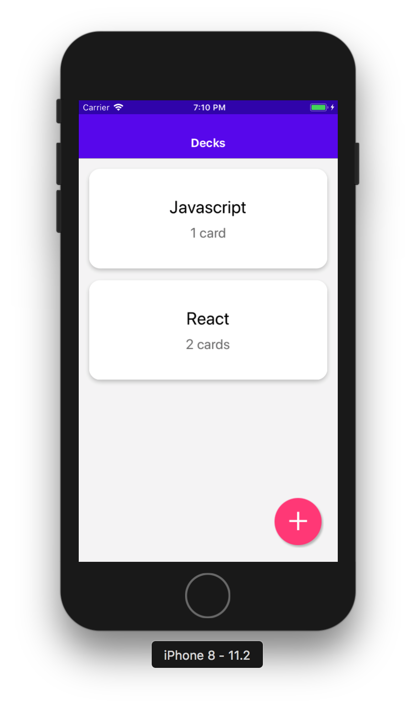
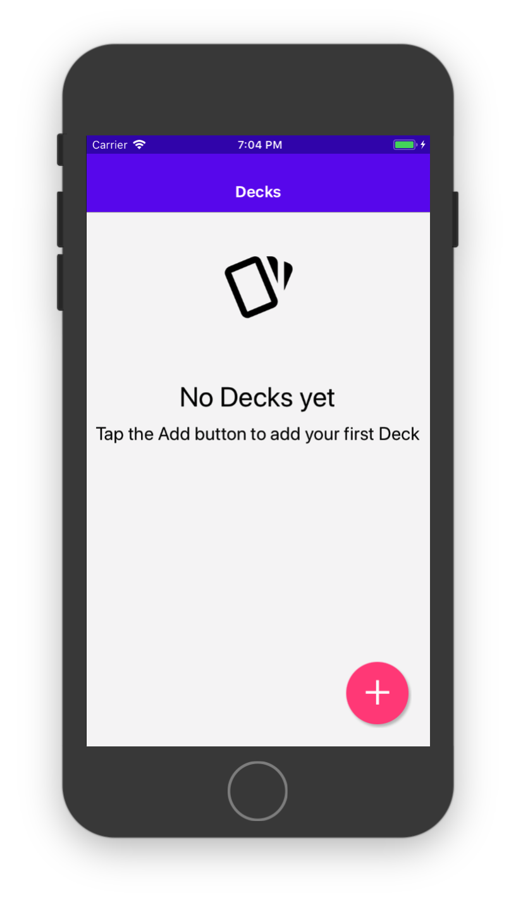
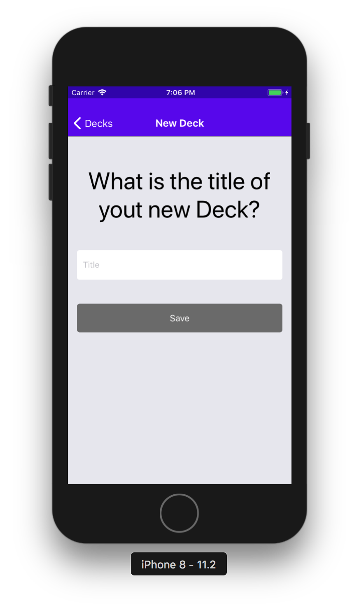
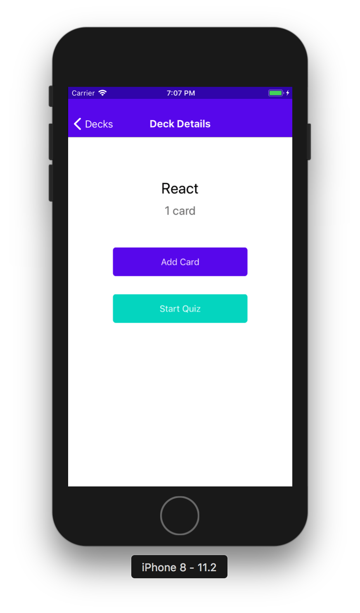
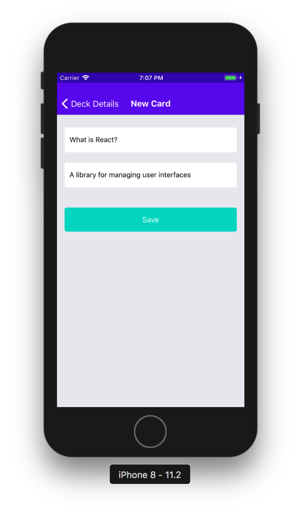
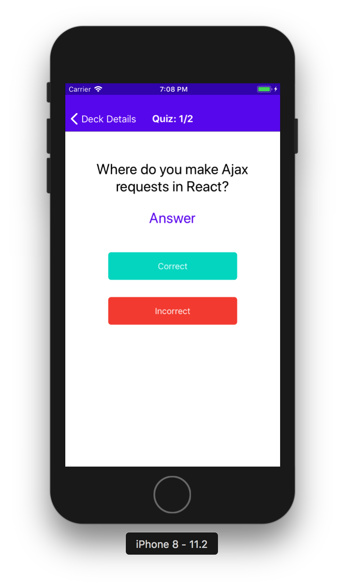
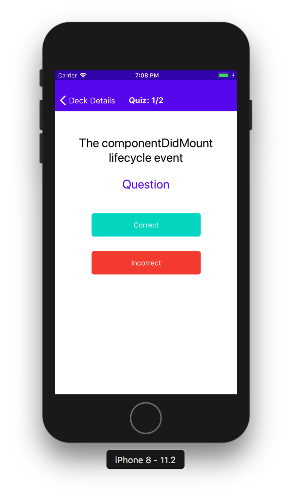
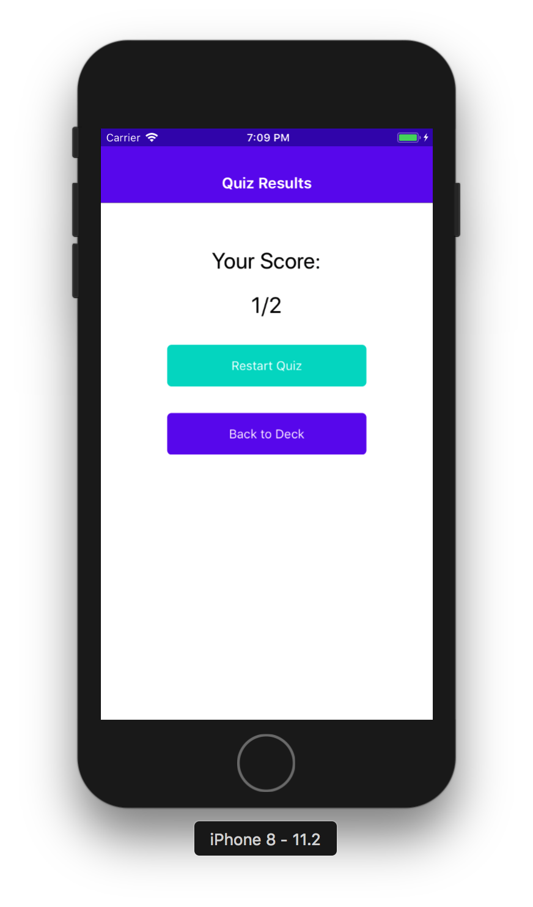

# Mobile Flashcards

"Mobile Flashcards" is a mobile application (Android and iOS) that allows users to study collections of flashcards. 

This project was bootstrapped with [Create React Native App](https://github.com/react-community/create-react-native-app).

# App Functionality

The app allows users to: 

- Create a deck which can hold an unlimited number of cards.
- Add a card to a specific deck.
- See the card Question in the front of the card. 
- See the card Answer in the back of the card. 
- Start a quiz on a specific deck and receive a score once the quiz is finished.
- Receive a notification to remind themselves to study if they haven't already for that day.

## List of Decks

Displays the list of existing decks as well as an Add Deck button used to add a new deck. 




## Add a New Deck

Add a new Deck by providing the deck title. 



## Deck Details

Check the details of an individual deck. It's also possible to add a Card to a deck or to start a new Quiz. 



## Add a New Card

Add a new Card by providing the Question and Answer for the card.



## Start a Quiz

Start a quiz for a particular deck. Navigate through all the cards of this deck and inform whether or not the answer was correctly guessed. 




## Quiz Results

Check the results once the quiz is finished. Restart the Quiz if needed or go back to the Deck Details. 



Below you'll find information about performing common tasks. The most recent version of this guide is available [here](https://github.com/react-community/create-react-native-app/blob/master/react-native-scripts/template/README.md).

## Table of Contents

* [Getting started](#getting-started)
  * [npm start](#npm-start)
  * [npm test](#npm-test)
  * [npm run ios](#npm-run-ios)
  * [npm run android](#npm-run-android)
  * [npm run eject](#npm-run-eject)

## Getting Started

In the project directory, you can run:

### `npm start`

Runs your app in development mode.

Open it in the [Expo app](https://expo.io) on your phone to view it. It will reload if you save edits to your files, and you will see build errors and logs in the terminal.

Sometimes you may need to reset or clear the React Native packager's cache. To do so, you can pass the `--reset-cache` flag to the start script:

```
npm start --reset-cache
# or
yarn start --reset-cache
```

#### `npm test`

Runs the [jest](https://github.com/facebook/jest) test runner on your tests.

#### `npm run ios`

Like `npm start`, but also attempts to open your app in the iOS Simulator if you're on a Mac and have it installed.

#### `npm run android`

Like `npm start`, but also attempts to open your app on a connected Android device or emulator. Requires an installation of Android build tools (see [React Native docs](https://facebook.github.io/react-native/docs/getting-started.html) for detailed setup). We also recommend installing Genymotion as your Android emulator. Once you've finished setting up the native build environment, there are two options for making the right copy of `adb` available to Create React Native App:

##### Using Android Studio's `adb`

1. Make sure that you can run adb from your terminal.
2. Open Genymotion and navigate to `Settings -> ADB`. Select “Use custom Android SDK tools” and update with your [Android SDK directory](https://stackoverflow.com/questions/25176594/android-sdk-location).

##### Using Genymotion's `adb`

1. Find Genymotion’s copy of adb. On macOS for example, this is normally `/Applications/Genymotion.app/Contents/MacOS/tools/`.
2. Add the Genymotion tools directory to your path (instructions for [Mac](http://osxdaily.com/2014/08/14/add-new-path-to-path-command-line/), [Linux](http://www.computerhope.com/issues/ch001647.htm), and [Windows](https://www.howtogeek.com/118594/how-to-edit-your-system-path-for-easy-command-line-access/)).
3. Make sure that you can run adb from your terminal.

#### `npm run eject`

This will start the process of "ejecting" from Create React Native App's build scripts. You'll be asked a couple of questions about how you'd like to build your project.

**Warning:** Running eject is a permanent action (aside from whatever version control system you use). An ejected app will require you to have an [Xcode and/or Android Studio environment](https://facebook.github.io/react-native/docs/getting-started.html) set up.